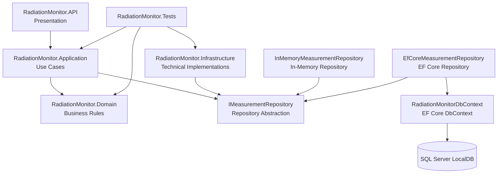

# Layered Architecture

## Overview
RadiationMonitor is organized into multiple layers. The objective is to isolate business rules from techical concerns.

The main layers are:
- Presentation (RadiationMonitor.API)
- Application (RadiationMonitor.Application)
- Domain (RadiationMonitor.Domain)
- Infrastructure (RadiationMonitor.Infrastructure)
- Tests (RadiationMonitor.Tests)

## Architecture Diagram

## Reponsibilities

### Presentation
- Receive external requests
- Expose application features
- Communication with external clients
- Act as the composition root fir dependency injection

### Application 
- Implement use cases
- Coordinate application workflow
- Depend on abstractions rather than infrastructure implementations

### Domain
- Business entities
- Business rules
- Validation
- Domain invariants

### Infrastructure
- Data persistence
- External systems
- Technical implementations
- Concrete implementation of application-defined repository contracts
- Entity Framework Core configuration
- SQL Server database access

The infrastructure layer currently contains both an in-memory repository and an Entity Framework Core implementation.

InMemoryMeasurementRepository stores measurements in memory and does not provide durable persistence.
EfCoreMeasurementRepository provides durable persistence through RadiationMonitorDbContext and SQL Server LocalDB.

## Dependency Injection
RadiationMonitor uses the ASP.NET Core dependency injection container to compose the application.
RegisterMeasurementService depends on the IMeasurementRepository abstraction, while RadiationMonitor.API configures the concrete implementation used by the application.
RadiationMonitor.API acts as the composition root and is responsible for configuring these dependencies.
Infrastructure provides the EF Core DbContext through the AddInfrastructure extension method.

The current application configuration still registers InMemoryMeasurementRepository as the implementation of IMeasurementRepository.
This means that the application currently uses the in-memory repository for the IMeasurementRepository dependency. 
RadiationMonitorDbContext is registered as Scoped, which is the standard lifetime used for an EF Core DbContext in an ASP.NET Core application.
The transition from the in-memory repository to EfCoreMeasurementRepository 
will be handled through dependency injection without changing the application use case or the repository abstraction.