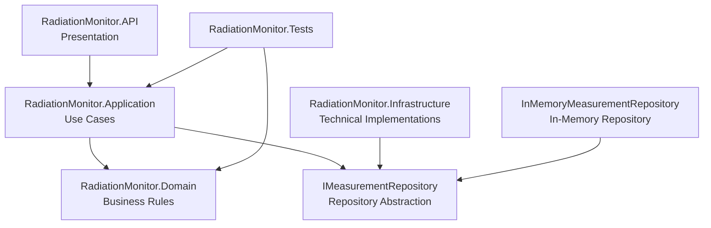

# Layered Architecture

## Overview
RadiationMonitor is organized into multiple layers. The objective is to isolate business rules from techical concerns.

## Architecture Diagram

## Reponsibilities

### Presentation
- Receive external requests
- Expose application features
- Communication with external clients

### Application 
- Implement use cases
- Coordinate application workflow

### Domain
- Business entities
- Business rules
- Validation

### Infrastructure
- Data persistence
- External systems
- Technical implementations
- Concrete implementation of application-defined repository contracts

The current implementation includes InMemoryMeasurementRepository, which stores measurements in memory and does not provide durable persistence.

## Dependency Injection
RadiationMonitor uses the ASP.NET Core dependency injection container to compose the application.
RegisterMeasurementService depends on the IMeasurementRepository abstraction, while RadiationMonitor.API configures the concrete implementation used by the application.

RadiationMonitor.API acts as the composition root and is responsible for configuring these dependencies.

The in-memory repository is currently registered as a Singleton because it owns the shared in-memory collection of measurements. RegisterMeasurementService is registered as Scoped, 
these lifetime choices may change when the persistence implementation is replaced by Entity Framework Core.