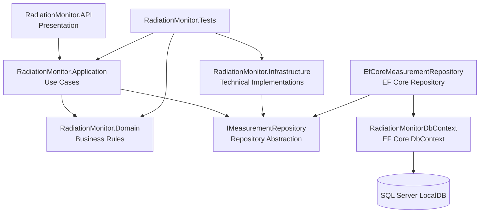

# Layered Architecture

## Overview
RadiationMonitor is organized into multiple layers.  The architecture separates business rules from application workflows, external interfaces and technical infrastructure.

The main layers are:
- Presentation (RadiationMonitor.API)
- Application (RadiationMonitor.Application)
- Domain (RadiationMonitor.Domain)
- Infrastructure (RadiationMonitor.Infrastructure)
- Tests (RadiationMonitor.Tests)

## Architecture Diagram

```mermaid
flowchart TD

API[RadiationMonitor.API<br/>Presentation]

APP[RadiationMonitor.Application<br/>Use Cases]

DOMAIN[RadiationMonitor.Domain<br/>Business Rules]

REPO[IMeasurementRepository<br/>Repository Abstraction]

INFRA[RadiationMonitor.Infrastructure<br/>Technical Implementations]

EF[EfCoreMeasurementRepository<br/>EF Core Repository]

DB[RadiationMonitorDbContext<br/>EF Core DbContext]

SQL[(SQL Server LocalDB)]

TESTS[RadiationMonitor.Tests]

API --> APP

APP --> DOMAIN
APP --> REPO

INFRA --> REPO
EF --> REPO
EF --> DB
DB --> SQL

TESTS --> DOMAIN
TESTS --> APP
TESTS --> INFRA

```

## Reponsibilities

### Presentation
RadiationMonitor.API is responsible for:
- Receiving external HTTP requests
- Exposing application use cases through the REST API
- Mapping HTTP requests to application commands and queries
- Mapping application results to HTTP responses
- Handling API-level exceptions
- Configuring application dependencies

The API project acts as the composition root for dependency injection.

### Application 
RadiationMonitor.Application is responsible for:
- Implementing application use cases
- Coordinating application workflows
- Defining application-level abstractions
- Depending on abstractions rather than infrastructure implementations

Current use cases include:
- Register Measurement
- Get Measurement

### Domain
RadiationMonitor.Domain contains:
- Domain entities
- Business rules
- Domain validation
- Domain invariants

The Measurement entity is responsible for enforcing the validity of its own state.

### Infrastructure
RadiationMonitor.Infrastructure contains technical implementations required by the application, including:
- Data persistence
- Entity Framework Core configuration
- SQL Server access
- Repository implementations
- Database context configuration

Two implementations of IMeasurementRepository exist:
- InMemoryMeasurementRepository provides non-durable in-memory storage.
- EfCoreMeasurementRepository provides durable persistence through Entity Framework Core and SQL Server LocalDB.
- The application currently uses EfCoreMeasurementRepository.

## Dependency Injection
RadiationMonitor uses the ASP.NET Core dependency injection container.
RadiationMonitor.API acts as the composition root and registers the application and infrastructure dependencies.

The repository abstraction is mapped to the Entity Framework Core implementation : services.AddScoped<IMeasurementRepository, EfCoreMeasurementRepository>();
Application services depend on IMeasurementRepository rather than directly on EfCoreMeasurementRepository.

RadiationMonitorDbContext is registered with a scoped lifetime, following the standard lifetime used for Entity Framework Core DbContext instances in ASP.NET Core.
The infrastructure dependency registration is encapsulated in the AddInfrastructure extension method.