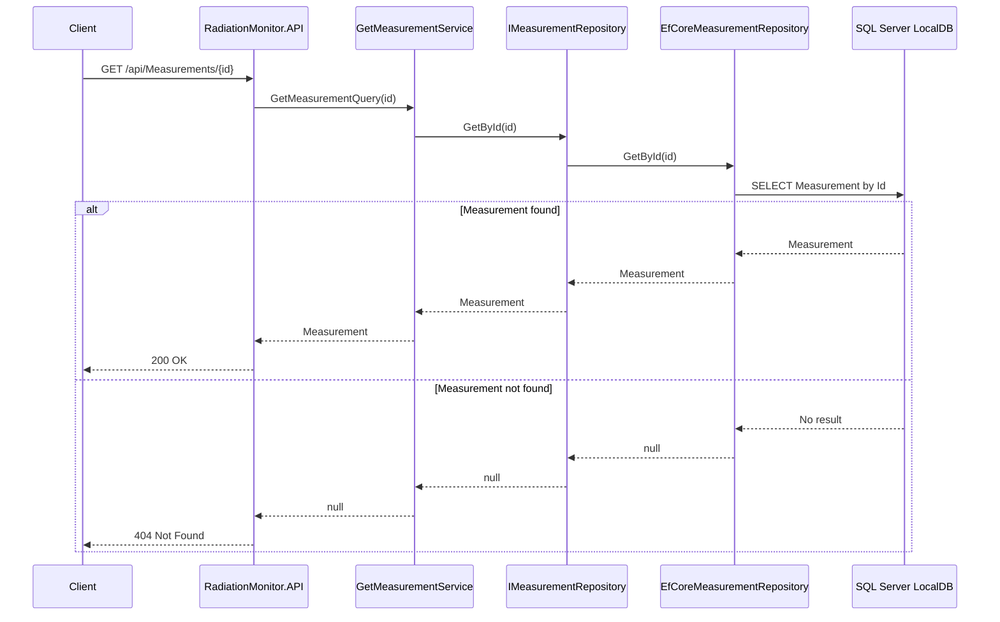

# Get Measurement

## Goal
The Get Measurement use case retrieves a measurement by its unique identifier.
Its responsibility is to coordinate the retrieval of an existing Measurement through the repository abstraction.
The use case does not contain business rules.

## Actor
The actor is an external system or application component requesting a previously registered measurement.

## Input
The use case receives a GetMeasurementQuery containing:
Id: Unique identifier of the measurement to retrieve

## Main Flow
1. The application receives a GetMeasurementQuery
2. GetMeasurementService requests the measurement from IMeasurementRepository
3. The repository searches for the measurement using its identifier
4. If the measurement exists, it is returned to the caller
5. If no measurement matches the identifier, the use case returns null

The use case depends on the IMeasurementRepository abstraction and does not depend on a specific persistence technology.
The current application configuration provides EfCoreMeasurementRepository as the concrete implementation.

## Responsibilities

### GetMeasurementService

Responsible for:

- orchestrating the retrieval operation
- requesting the measurement from IMeasurementRepository
- returning the retrieved measurement or null

Not responsible for:
- defining business rules
- implementing persistence
- determining HTTP response codes

### IMeasurementRepository

Responsible for:
- defining the retrieval operation required by the Application layer
- abstracting the persistence mechanism from the use case.

The current concrete implementation is EfCoreMeasurementRepository.

### Error and Result Cases

The use case has two possible results:
- A Measurement is found and returned
- No matching Measurement is found and null is returned.

The API layer maps these results to HTTP responses:
- Measurement found → 200 OK
- null returned → 404 Not Found

The use case itself does not depend on HTTP concepts.

## Testing

The API behavior is covered by integration tests verifying :
- retrieval of an existing measurement
- 200 OK response
- returned measurement data
- 404 Not Found when the measurement does not exist