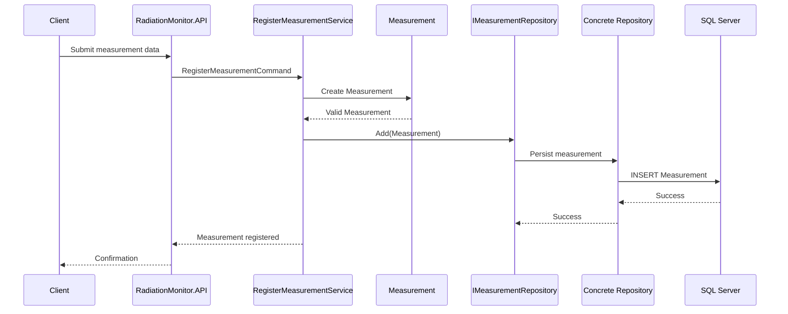

# Register Measurement

## Goal
The RegisterMeasurement use case allows the system to register a radiation measurement acquired from a detector.Its responsibility is to coordinate 
the creation and persistence of a valid Measurement.

The use case does not contain business rules. These rules belong to the Domain layer.

## Actor
The actor is an external system or application component providing measurement data from a radiation detector.

Examples:

- detector monitoring system
- acquisition software
- operator interface

## Input
The use case receives a RegisterMeasurementCommand containing:

| Field | Description |
|---|---|
| DetectorId | Identifier of the detector |
| Timestamp | Acquisition time |
| DoseRate | Measured radiation dose rate |
| Status | Detector operational status |

## Main Flow

1. The application receives a RegisterMeasurementCommand.
2. The RegisterMeasurementService creates a new Measurement.
3. The Domain validates business invariants.
4. The valid measurement is passed to the repository.
5. The repository stores the measurement.
1. The use case does not depend on a specific persistence technology.

The concrete repository implementation is provided by the Infrastructure layer.

Currently, the Infrastructure layer provides:
- InMemoryMeasurementRepository for in-memory persistence
- EfCoreMeasurementRepository for durable persistence through Entity Framework Core and SQL Server

The SQL Server persistence path is validated through an integration test using SQL Server LocalDB.

## Business Rules
The created measurement must satisfy all Domain rules:

- Detector identifier must be provided.
- Timestamp must be valid.
- Dose rate cannot be negative.
- Detector status cannot be Unknown.
- Detector status cannot be Error.

## Error Cases
The operation fails when:

- input data is invalid
- the created measurement does not comply with domain rules
- persistence fails

## Responsibilities

### RegisterMeasurementService
Responsible for:

- orchestrating the use case
- creating domain objects
- interacting with repositories

Not responsible for:

- defining business rules
- storing data directly

### Measurement
Responsible for:

- protecting domain invariants
- ensuring that only valid measurements exist
- generating the measurement identifier

### Repository
Responsible for:

- abstracting data persistence from the Application layer
- providing the data access operations required by application use cases
- hiding the underlying persistence mechanism from the Application layer

The repository contract is defined by IMeasurementRepository. Concrete implementations are provided by the Infrastructure layer.

Current implementations include:
- InMemoryMeasurementRepository
- EfCoreMeasurementRepository

EfCoreMeasurementRepository uses RadiationMonitorDbContext and Entity Framework Core to persist measurements in SQL Server.

## Testing
The use case is covered by unit tests using a repository test double.
Persistence is tested separately through integration tests.

The SQL Server integration test verifies that EfCoreMeasurementRepository can:
1. persist a valid Measurement
2. write the measurement to SQL Server LocalDB
3. retrieve it using a new DbContext
4. preserve the persisted values