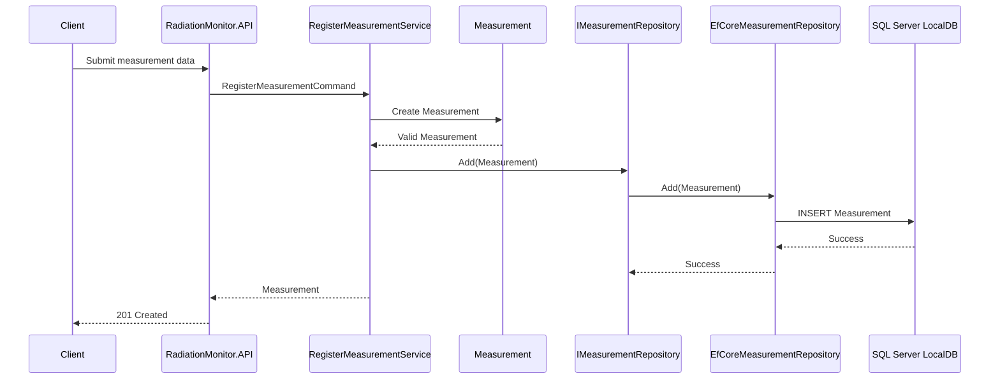

# Register Measurement

## Goal
The Register Measurement use case registers a radiation measurement acquired from a detector.
Its responsibility is to coordinate the creation of a valid Measurement and its persistence.

The use case does not define business rules. Business rules are enforced by the Domain layer.

## Actor
The actor is an external system or application component providing measurement data from a radiation detector.

Examples includes :
- detector monitoring system
- acquisition software
- operator interface

## Input
The use case receives a RegisterMeasurementCommand containing:

| Field | Description |
|---|---|
| DetectorId | Identifier of the detector |
| Timestamp | Acquisition time |
| DoseRate | Measured radiation dose rate |
| Status | Detector operational status |

## Main Flow

1. The application receives a RegisterMeasurementCommand.
2. RegisterMeasurementService creates a Measurement.
3. The Measurement enforces the domain invariants.
4. The valid Measurement is passed to IMeasurementRepository.
5. The repository persists the measurement using its configured implementation.
6. The created Measurement is returned to the caller.

The use case depends on the IMeasurementRepository abstraction and does not depend on a specific persistence technology.
The current application configuration provides EfCoreMeasurementRepository as the concrete implementation.
EfCoreMeasurementRepository uses RadiationMonitorDbContext and Entity Framework Core to persist measurements in SQL Server LocalDB.

## Business Rules
The created measurement must satisfy all Domain rules:

- DetectorId must not be null, empty or whitespace.
- Timestamp must not be the default DateTimeOffset value.
- DoseRate must be greater than or equal to zero.
- Status must not be Unknown.
- Status must not be Error.

These rules are enforced by the Measurement entity.

## Error Cases
The operation fails when:
- the input violates a domain invariant
- persistence fails

Domain validation failures represented by InvalidMeasurementException are handled by the API exception handler and returned as HTTP 400 Bad Request responses using ProblemDetails.
Persistence failures are technical errors handled outside the Domain and Application business rules.

## Responsibilities

### RegisterMeasurementService
Responsible for:

- orchestrating the use case
- creating the Measurement domain entity
- passing the valid entity to IMeasurementRepository
- returning the created measurement

Not responsible for:

- defining business rules
- implementing persistence
- depending on a specific database technology

### Measurement
Responsible for:

- enforcing domain invariants
- preventing creation of an invalid measurement
- generating the measurement identifier

### IMeasurementRepository
Responsible for:
- defining the persistence operations required by the Application layer
- abstracting the persistence mechanism from the use case

The concrete implementation is provided by the Infrastructure layer.

```mermaid
sequenceDiagram

participant Client
participant API as RadiationMonitor.API
participant Service as RegisterMeasurementService
participant Domain as Measurement
participant Repository as IMeasurementRepository
participant Persistence as EfCoreMeasurementRepository
participant DB as SQL Server LocalDB

Client->>API: Submit measurement data

API->>Service: RegisterMeasurementCommand

Service->>Domain: Create Measurement

Domain-->>Service: Valid Measurement

Service->>Repository: Add(Measurement)

Repository->>Persistence: Add(Measurement)
Persistence->>DB: INSERT Measurement

DB-->>Persistence: Success
Persistence-->>Repository: Success

Service-->>API: Measurement

API-->>Client: 201 Created
```

## Testing
The use case is covered by unit tests using a repository test double.
Persistence is tested separately through integration tests.

The persistence integration tests verify that EfCoreMeasurementRepository can :
1. Persist a valid Measurement
2. Store the measurement in SQL Server LocalDB
3. Retrieve the persisted measurement using a new DbContext
4. Preserve the persisted values