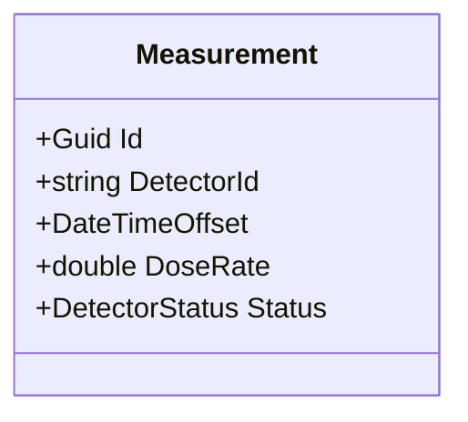

# Measurement

## Purpose

A Measurement represents a validated radiation dose rate acquired from a detector at a specific point in time. It is the central business entity 
of the RadiationMonitor domain.
A measurement is considered valid only if it satisfies all business invariants defined by the domain model.

## Responsibilities

- Identifying the detector that produced the measurement
- Storing the acquisition timestamp
- Storing the measured dose rate
- Representing the detector operational status
- Ensuring that all business invariants are respected at creation time

## Attributes

| Attribute | Description |
|-----------|-------------|
| Id | Unique identifier of the measurement |
| DetectorId | Identifier of the detector that produced the measurement |
| Timestamp | Date and time when the measurement was acquired |
| DoseRate | Measured radiation dose rate |
| Status | Operational status of the detector |

## Business Invariants

To be considered valid, a Measurement must comply with these rules :

- DetectorId must not be null.
- DetectorId must not be empty.
- DetectorId must not contain only whitespace.
- Timestamp must be defined.
- DoseRate must be greater than or equal to zero.
- Status must not be Unknown.
- Status must not be Error.

A Measurement instance cannot exist in an invalid state.

## Notes
Business validation belongs to the Domain layer and must remain independent from technical concerns such as databases, HTTP or user interfaces.

