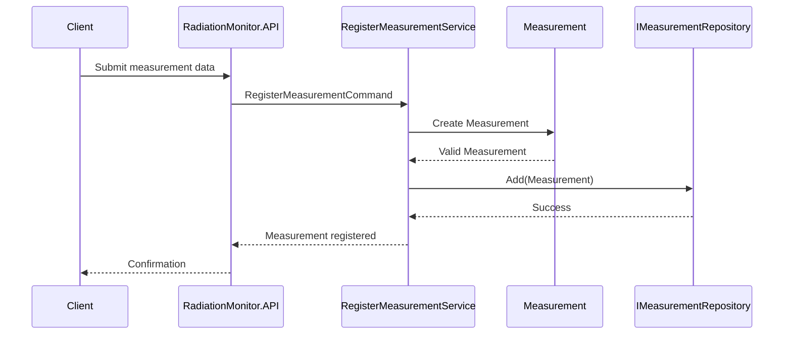

# Register Measurement

## Goal
The RegisterMeasurement use case allows the system to register a radiation measurement acquired from a detector.Its responsibility is to coordinate 
the creation and persistence of a valid Measurement.

The use case does not contain business rules. These rules belong to the Domain layer.

## Actor
The actor is an external system or application component providing measurement data from a radiation detector.

Examples:

- detector monitoring system
- acquisition software
- operator interface

## Input
The use case receives a RegisterMeasurementCommand containing:

| Field | Description |
|---|---|
| DetectorId | Identifier of the detector |
| Timestamp | Acquisition time |
| DoseRate | Measured radiation dose rate |
| Status | Detector operational status |

## Main Flow

1. The application receives a RegisterMeasurementCommand.
2. The RegisterMeasurementService creates a new Measurement.
3. The Domain validates business invariants.
4. The valid measurement is passed to the repository.
5. The repository stores the measurement.

## Business Rules
The created measurement must satisfy all Domain rules:

- Detector identifier must be provided.
- Timestamp must be valid.
- Dose rate cannot be negative.
- Detector status cannot be Unknown.
- Detector status cannot be Error.

## Error Cases
The operation fails when:

- input data is invalid
- the created measurement does not comply with domain rules
- persistence fails

## Responsibilities

### RegisterMeasurementService
Responsible for:

- orchestrating the use case
- creating domain objects
- interacting with repositories

Not responsible for:

- defining business rules
- storing data directly

### Measurement
Responsible for:

- protecting domain invariants
- ensuring that only valid measurements exist

### Repository
Responsible for:

- abstracting persistence mechanisms

