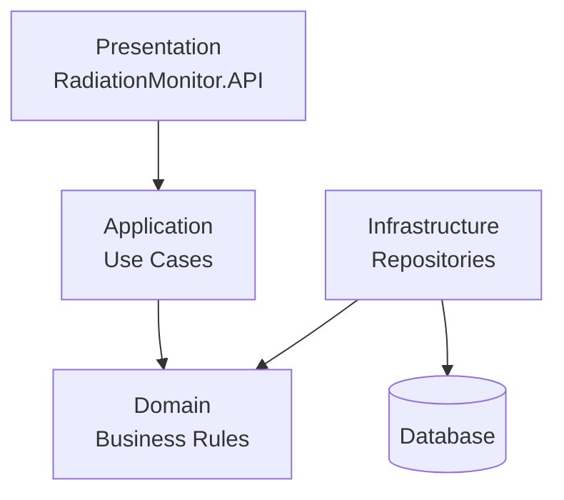

# Layered Architecture

## Overview
RadiationMonitor is organized into multiple layers. The objective is to isolate business rules from techical concerns.

## Architecture Diagram

## Reponsibilities

### Presentation
- Receive external requests
- Expose application features
- Communication with external clients

### Application 
- Implement use cases
- Coordinate application workflow

### Domain
- Business entities
- Business rules
- Validation

### Infrastructure
- Data persistence
- External systems
- Technical implementations